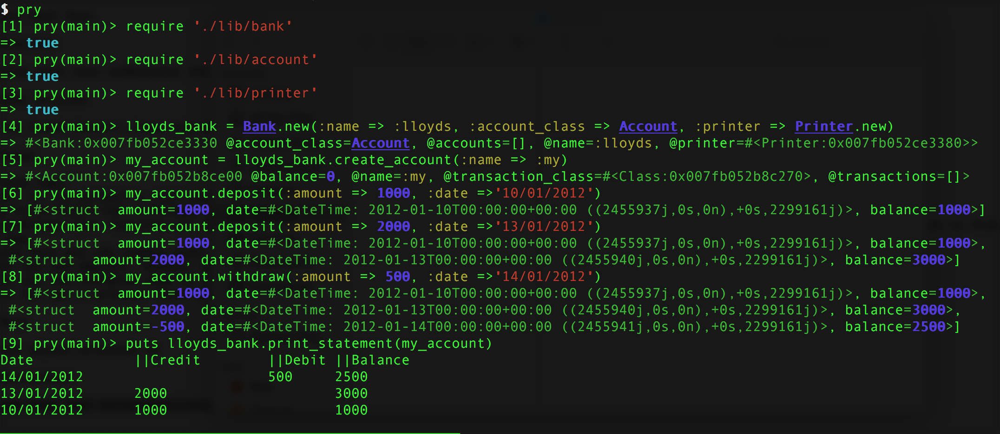

[](https://travis-ci.org/AAMani5/bank_tech_test)[](https://coveralls.io/github/AAMani5/bank_tech_test?branch=master)

## Makers Academy Week 10 - Tech Test challenge 'Bank'

Week 10 was allocated for us to practise tech tests using any Programming language of our choosing.  

### Requirements

* You should be able to interact with the your code via a REPL like IRB or the JavaScript console.  (You don't need to implement a command line interface that takes input from STDIN.)
* Deposits, withdrawal.
* Account statement (date, amount, balance) printing.
* Data can be kept in memory (it doesn't need to be stored to a database or anything).

### Acceptance criteria

**Given** a client makes a deposit of 1000 on 10-01-2012
**And** a deposit of 2000 on 13-01-2012
**And** a withdrawal of 500 on 14-01-2012
**When** she prints her bank statement
**Then** she would see

```
date || credit || debit || balance
14/01/2012 || || 500.00 || 2500.00
13/01/2012 || 2000.00 || || 3000.00
10/01/2012 || 1000.00 || || 1000.00
```

## User Stories

```
As a User,
So that I can use the features provided by your code
I want to be able to interact with it using a REPL.

As a Customer,
So that I can have my own account
I want to be able to create a bank account.

As a Customer,
So that I can have money in my account
I want to be able to deposit money into my account.

As a Customer,
So that I can use my money when needed
I want to be able to make withdrawals from my account.

As a Customer,
So that I can view the amount of money in my account at any given time
I want to be able to check balance.

As a Customer,
So that I can see my transactions
I want to be able to print my account statement.

  Acceptance criteria: statement should show date, indicate debit/credit and balance after each transaction.
```

### Programming language used
 - Ruby

### Installation, Use and Run tests
 - clone this repo
 - move into the folder
 - to run test : ``` rspec ```

### Feature test and results

```
lloyds_bank = Bank.new(:name => :lloyds, :account_class => Account, :printer => Printer.new)

my_account = lloyds_bank.create_account(:name => :my)

my_account.deposit(:amount => 1000, :date =>'10/01/2012')
my_account.deposit(:amount => 2000, :date =>'13/01/2012')
my_account.withdraw(:amount => 500, :date =>'14/01/2012')

puts lloyds_bank.print_statement(my_account)
```

```
Date		||Credit	||Debit	||Balance
14/01/2012	 		    500	    2500
13/01/2012	2000		 	      3000
10/01/2012	1000		 	      1000
_______________________________________________________
```
### Screenshot

